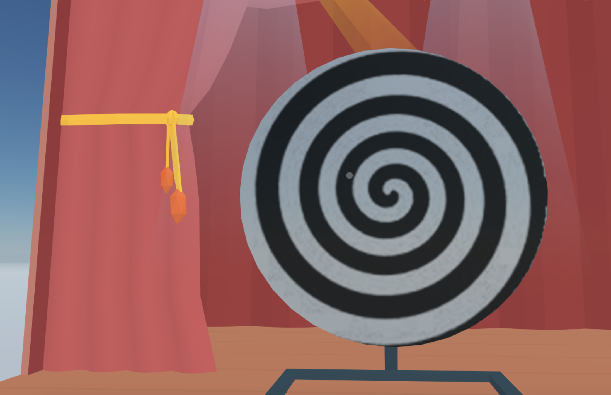

## Hypno wheels

This simple scene features a couple of wheels that you can spin by clicking them. 



Read the [tutorial](https://decentraland.org/blog/tutorials/intro-to-sdk-v5/) about this scene

This scene shows you:
- How to add 3D models
- How to rotate an entity
- How to handle click events
- How to apply textures to primitive shapes
- How to create custom components to store custom data 
- How to use systems to make gradual changes on every frame
- How to use component groups to keep track of multiple entities


## Try it out

**Install the CLI**

Download and install the Decentraland CLI by running the following command:

```bash
npm i -g decentraland
```

**Previewing the scene**

Download this example and navigate to its directory, then run:

```
$:  dcl start
```

Any dependencies are installed and then the CLI opens the scene in a new browser tab.

**Scene Usage**

Click a wheel to make it spin. The more times you click it, the faster it spins.

Learn more about how to build your own scenes in our [documentation](https://docs.decentraland.org/) site.

If something doesn’t work, please [file an issue](https://github.com/decentraland-scenes/Awesome-Repository/issues/new).

## Copyright info

This scene is protected with a standard Apache 2 licence. See the terms and conditions in the [LICENSE](/LICENSE) file.
